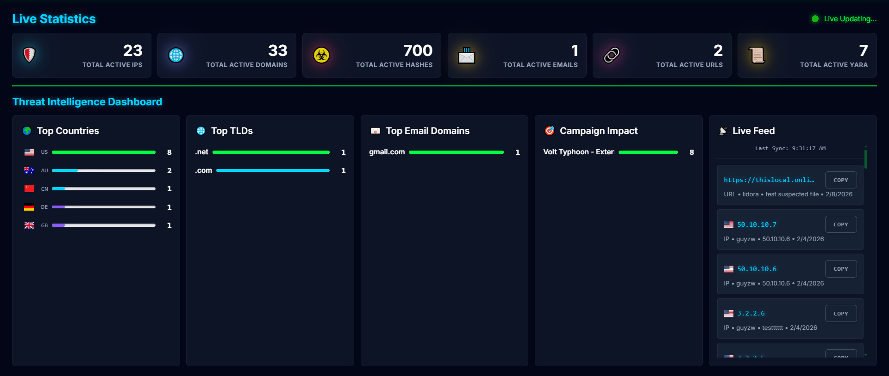
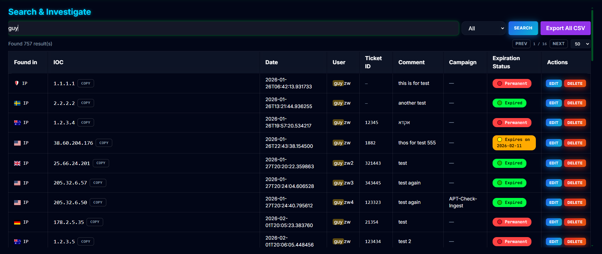
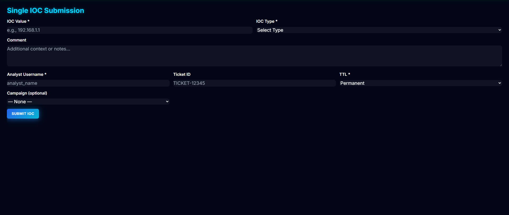
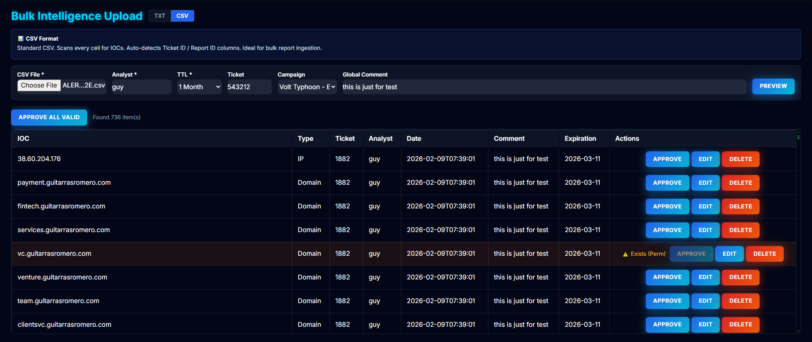
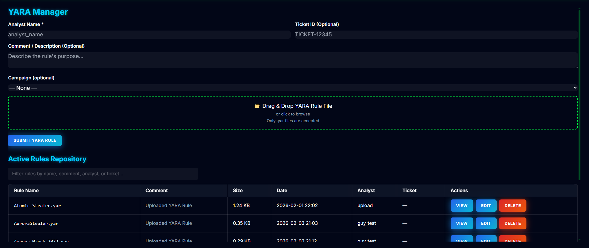
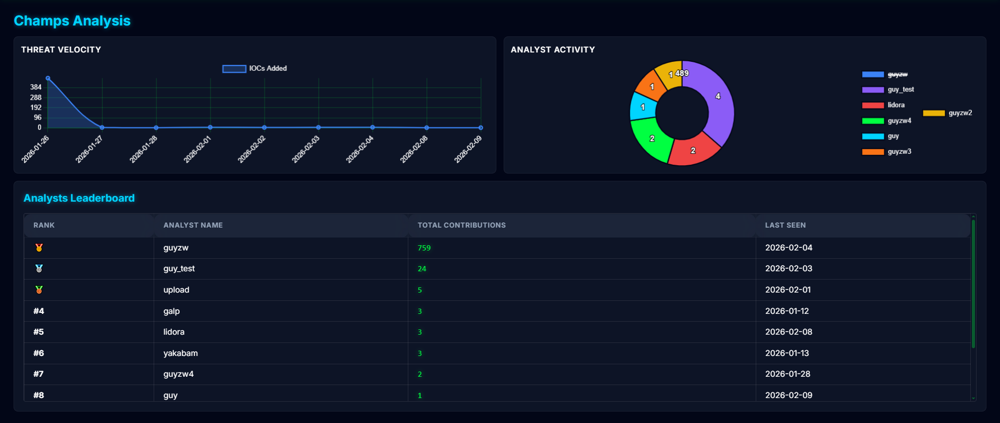
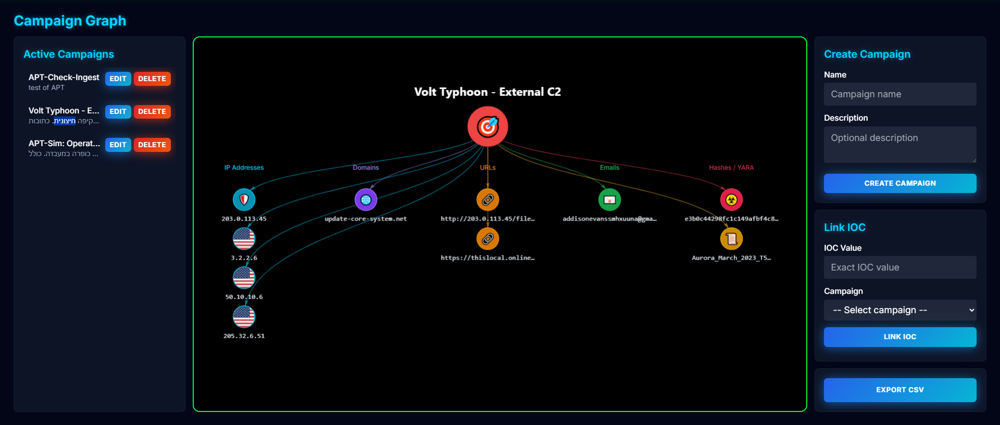

# ThreatGate v4.0 — Commander Edition

ThreatGate is a **modern IOC & YARA Management Platform** built for SOC operations with SQLite backend. Analysts submit indicators, ThreatGate stores them in a database, and security devices ingest **plain-text feeds** (IOC-only) for enforcement.

This release is the **v4.0 Commander Edition**: a modern **cyber-glass** workstation with a clean separation between **Threat Intelligence** and **Analyst Performance**.

---

## Features

- **Modern Glass UI (Glassmorphism)**: translucent cards, subtle blur, neon accents
- **Light/Dark Mode**: Dark mode with neon commander styling, Light mode with clean corporate styling
- **SQLite Backend**: Fast, reliable database storage with automatic migration from legacy file-based system
- **Campaign Management**: Visual graph representation of campaigns and their associated IOCs
- **YARA Rule Management**: Upload, view, edit, and manage YARA rules
- **Multi-language Support**: English and Hebrew (עברית)
- **Feed Generation**: Multiple feed formats for different firewall vendors (Palo Alto, Checkpoint, Standard)
- **RESTful API**: Full API support for automated IOC management

---

## Table of Contents

- [Installation](#installation)
  - [Option 1: Online Installation (Linux with Internet)](#option-1-online-installation-linux-with-internet)
  - [Option 2: Offline Installation (Linux Air-Gapped)](#option-2-offline-installation-linux-air-gapped)
- [UI Screens Overview](#ui-screens-overview)
- [Feed Endpoints](#feed-endpoints)
- [API Endpoints](#api-endpoints)
- [Data Model](#data-model)
- [Configuration](#configuration)
- [Maintenance](#maintenance)
- [Security Considerations](#security-considerations)
- [Migration from Legacy File-Based System](#migration-from-legacy-file-based-system)
- [Offline / Air-Gapped Deployment](#offline--air-gapped-deployment)
- [Troubleshooting](#troubleshooting)
- [What's New in v4.0](#whats-new-in-v40)
- [Version](#version)

---

## Installation

ThreatGate supports **two installation methods** for Linux production environments:

1. **Online Installation** - When the Linux server has internet connectivity
2. **Offline Installation** - For air-gapped environments using a pre-packaged ZIP file

Both methods use the same installation script (`setup.sh`) but with different modes.

---

### Option 1: Online Installation (Linux with Internet)

This method requires internet connectivity to download Python packages from PyPI.

#### Prerequisites

- Linux server with internet connectivity
- Python 3.8+ installed
- Root/sudo access
- Git (optional, if cloning from repository)

#### Installation Steps

1. **Clone or copy the ThreatGate repository to the server:**
   ```bash
   git clone <repository-url>
   cd ThreatGate
   ```
   
   Or copy the ThreatGate directory to the server via SCP/SFTP.

2. **Run the installation script:**
   ```bash
   sudo ./setup.sh
   ```

3. **The script will:**
   - Create system user `threatgate`
   - Set up directory structure at `/opt/threatgate`
   - Copy application files
   - Create Python virtual environment
   - Install dependencies from PyPI (online)
   - Install and start systemd services
   - Enable automatic startup

4. **Verify installation:**
   ```bash
   systemctl status threatgate
   ```

5. **Access the web UI:**
   ```
   http://<server-ip>:8000
   ```

#### Post-Installation

- **View logs:** `journalctl -u threatgate -f`
- **Restart service:** `sudo systemctl restart threatgate`
- **Check cleaner timer:** `systemctl status threatgate-cleaner.timer`

---

### Option 2: Offline Installation (Linux Air-Gapped)

This method is for servers without internet connectivity. You need to prepare an offline package on a machine with internet access, then transfer it to the target server.

#### Step 1: Prepare Offline Package (On Machine with Internet)

1. **Clone or download ThreatGate repository:**
   ```bash
   git clone <repository-url>
   cd ThreatGate
   ```

2. **Run the offline package builder:**
   ```bash
   ./package_offline.sh
   ```

3. **This script will:**
   - Download all Python package wheels (dependencies)
   - Copy all application files
   - Create `threatgate_installer.zip` in the project root

4. **Transfer the ZIP file to the target server:**
   ```bash
   # Using SCP
   scp threatgate_installer.zip user@target-server:/tmp/
   
   # Or using USB drive, network share, etc.
   ```

#### Step 2: Install on Target Server (Air-Gapped)

1. **Extract the ZIP file:**
   ```bash
   cd /tmp
   unzip threatgate_installer.zip -d threatgate_install
   cd threatgate_install
   ```

2. **Run the installation script in offline mode:**
   ```bash
   sudo ./setup.sh --offline
   ```

3. **The script will:**
   - Create system user `threatgate`
   - Set up directory structure at `/opt/threatgate`
   - Copy application files
   - Create Python virtual environment
   - Install dependencies from local wheels (offline)
   - Install and start systemd services
   - Enable automatic startup

4. **Verify installation:**
   ```bash
   systemctl status threatgate
   ```

5. **Access the web UI:**
   ```
   http://<server-ip>:8000
   ```

#### Important Notes for Offline Installation

- The `packages/` directory must be present in the extracted ZIP (contains Python wheels)
- Ensure all required system packages are installed on the target server (Python 3.8+, SQLite3)
- The offline package includes all dependencies, so no internet connection is needed

---

### Local Development Installation

For development purposes on your local machine:

```bash
# Clone repository
git clone <repository-url>
cd ThreatGate

# Create virtual environment
python3 -m venv venv
source venv/bin/activate  # On Windows: venv\Scripts\activate

# Install dependencies
pip install -r requirements.txt

# Run application
python app.py
```

Open `http://127.0.0.1:5000` in your browser.

---

### Windows Installation

For Windows servers, use Waitress:

```bash
# Install Waitress
pip install waitress

# Run application
waitress-serve --host=0.0.0.0 --port=5000 app:app
```

**Note:** Production deployment on Windows is not officially supported. Linux with systemd is recommended.

---

## UI Screens Overview

### 1. Live Stats (Threat Intelligence Dashboard)



> **Screenshot Placeholder:** Capture the **Live Stats** tab showing:
> - Sticky summary cards (Active IPs / Domains / Hashes / Emails / URLs)
> - **3-column intelligence view**:
>   - **Top Countries** leaderboard (flag + country code + progress bars)
>   - **Top TLDs** leaderboard (globe + `.tld` labels + progress bars)
>   - **Top Email Domains** leaderboard (envelope + `domain.tld` labels + progress bars)
> - "Live Updating…" indicator (when active)
> - Recent IOCs feed sidebar

**Functionality:**
- Real-time statistics for all IOC types
- Top 10 countries by IP count (with flag icons)
- Top 10 TLDs by domain count
- Top 10 email domains
- Live feed of last 50 IOCs
- Auto-refresh every 10 seconds

---

### 2. Search & Investigate



> **Screenshot Placeholder:** Capture the **Search & Investigate** tab showing:
> - Search field + filter dropdown (`All`, `IOC Value`, `Ticket ID`, `User`, `Date`)
> - Results table with Expiration badges + Actions (Edit/Delete)
> - Search results with country flags for IPs

**Functionality:**
- Search across all IOC types and metadata
- Filter by: IOC Value, Ticket ID, User, Date, or All fields
- View expiration status (Active/Expired/Permanent)
- Edit IOC metadata (comment, expiration, ticket ID, campaign)
- Delete/Revoke IOCs
- View country information for IP addresses

---

### 3. Single Submission



> **Screenshot Placeholder:** Capture the **Single Submission** tab showing:
> - IOC Value, Type dropdown, Comment, Analyst, Ticket ID, TTL selector
> - Campaign assignment dropdown
> - A success toast notification

**Functionality:**
- Submit individual IOCs (IP, Domain, Hash, Email, URL)
- Auto-detection of IOC type
- Input cleaning (refanger) for obfuscated IOCs
- TTL selection (1 Week, 1 Month, 3 Months, 1 Year, Permanent)
- Campaign assignment
- Allowlist validation (prevents blocking critical assets)
- Duplicate detection

---

### 4. Bulk Upload



> **Screenshot Placeholder:** Capture the **Bulk Upload** tab showing:
> - CSV/TXT mode toggle
> - File upload area
> - Preview table with staging functionality
> - Bulk submission options

**Functionality:**

**CSV Mode:**
- Upload CSV files with IOC data
- Auto-detect IOCs in any column
- Extract ticket IDs from columns (ReportID, Ticket_ID, Ref, Reference)
- Preview before submission
- Bulk import with conflict handling

**TXT Mode:**
- Upload text files with IOC entries
- Parse metadata from comments (Date, User, Ref, Comment, EXP)
- Smart metadata extraction
- Preview with existing IOC detection

---

### 5. YARA Manager



> **Screenshot Placeholder:** Capture the **YARA Manager** tab showing:
> - YARA rules list with metadata
> - Upload form
> - Rule preview modal
> - Edit/Delete actions

**Functionality:**
- Upload `.yar` files
- View all YARA rules with metadata
- Preview rule content
- Edit rule metadata (ticket ID, comment, campaign)
- Delete rules
- YARA syntax validation
- Campaign assignment

---

### 6. Champs Analysis (Team Performance)



> **Screenshot Placeholder:** Capture the **Champs Analysis** tab showing:
> - **Threat Velocity** (line chart showing IOCs per day)
> - **Analyst Activity** (pie/doughnut chart)
> - Analyst leaderboard with 🥇🥈🥉 for top 3
> - Historical IOCs table

**Functionality:**
- Threat velocity chart (IOCs submitted per day)
- Analyst activity distribution (pie chart)
- Analyst leaderboard with weighted scores
- YARA uploads count as 5x points
- Historical IOC statistics

---

### 7. Campaign Graph



> **Screenshot Placeholder:** Capture the **Campaign Graph** tab showing:
> - Left sidebar: Active Campaigns list
> - Center: Visual graph with campaign node and IOC columns
> - Right sidebar: Create Campaign form, Link IOC form, Export button
> - Graph showing campaign connected to IOCs organized by type

**Functionality:**
- Visual representation of campaigns and their IOCs
- Create new campaigns
- Link IOCs to campaigns
- Export campaign data to CSV
- Interactive graph visualization (zoom, pan, drag)
- Color-coded IOC types (IP, Domain, URL, Email, Hash, YARA)
- Country flags for IP addresses

---

## Feed Endpoints

ThreatGate provides multiple feed formats for different security devices and firewall vendors.

### Standard Feeds

Plain text feeds with one IOC per line:

| Endpoint | Description | Example Output |
|----------|-------------|----------------|
| `/feed/ip` | IP addresses | `192.168.1.1`<br>`10.0.0.1` |
| `/feed/domain` | Domains | `malicious.com`<br>`evil.tld` |
| `/feed/url` | URLs (with protocol) | `https://bad.com/path`<br>`http://evil.com/api` |
| `/feed/hash` | All hash types (MD5, SHA1, SHA256) | `abc123...`<br>`def456...` |
| `/feed/md5` | MD5 hashes only (32 chars) | `5d41402abc4b2a76b9719d911017c592` |
| `/feed/sha1` | SHA1 hashes only (40 chars) | `aaf4c61ddcc5e8a2dabede0f3b482cd9aea9434d` |
| `/feed/sha256` | SHA256 hashes only (64 chars) | `e3b0c44298fc1c149afbf4c8996fb92427ae41e4649b934ca495991b7852b855` |

**Content-Type:** `text/plain`

**Example:**
```bash
curl https://threatgate.example.com/feed/ip
```

---

### Palo Alto Feeds

Palo Alto firewalls require URLs without protocol prefix:

| Endpoint | Description | Format |
|----------|-------------|--------|
| `/feed/pa/ip` | IP addresses | Standard format |
| `/feed/pa/domain` | Domains | Standard format |
| `/feed/pa/url` | URLs **without** http/https | `bad.com/path`<br>`evil.com/api` |
| `/feed/pa/md5` | MD5 hashes | Standard format |
| `/feed/pa/sha1` | SHA1 hashes | Standard format |
| `/feed/pa/sha256` | SHA256 hashes | Standard format |

**Example:**
```bash
# URL feed for Palo Alto (protocol stripped)
curl https://threatgate.example.com/feed/pa/url
# Output: zxcvb.pw/api/bot/getSettings.php
```

**Palo Alto EDL Setup:**
- **Type**: IP Address List / Domain List / URL List (per endpoint)
- **Source**: `https://<threatgate-host>/feed/pa/ip`
- **Refresh**: 5 minutes (recommended)

---

### Checkpoint Feeds

Checkpoint firewalls require CSV format with specific structure:

| Endpoint | Description | Format |
|----------|-------------|--------|
| `/feed/cp/ip` | IP addresses | CSV with observe numbers |
| `/feed/cp/domain` | Domains | CSV with observe numbers |
| `/feed/cp/url` | URLs (with protocol) | CSV with observe numbers |
| `/feed/cp/hash` | All hash types | CSV with observe numbers |
| `/feed/cp/md5` | MD5 hashes only | CSV with observe numbers |
| `/feed/cp/sha1` | SHA1 hashes only | CSV with observe numbers |
| `/feed/cp/sha256` | SHA256 hashes only | CSV with observe numbers |

**CSV Format:**
```csv
#Uniq-Name,#Value,#Type,#Confidence,#Severity,#Product,#Comment
observe1,98.160.48.170,ip,high,high,AV,"""Malicious IP"""
observe2,98.172.212.35,ip,high,high,AV,"""Malicious IP"""
observe3,https://zxcvb.pw,url,high,high,AV,"""Malicious URL"""
observe4,http://zxcvb.pw/api/bot/getSettings.php,url,high,high,AV,"""Malicious URL"""
observe5,00faa625e3d1c41d5eceff54a473a408,md5,high,high,AV,"""Malicious Hash"""
```

**Example:**
```bash
curl https://threatgate.example.com/feed/cp/ip
```

**Checkpoint Setup:**
- Import feed as CSV threat intelligence feed
- Configure automatic updates (recommended: 5 minutes)
- Feed includes all active (non-expired) IOCs

---

### YARA Feeds

| Endpoint | Description | Format |
|----------|-------------|--------|
| `/feed/yara-list` | List of all YARA rule filenames | One filename per line |
| `/feed/yara-content/<filename>` | Raw content of a specific YARA rule | Plain text YARA rule content |

**Example:**
```bash
# Get list of YARA rules
curl https://threatgate.example.com/feed/yara-list

# Get specific YARA rule content
curl https://threatgate.example.com/feed/yara-content/rule.yar
```

---

### Feed Behavior

- **Active IOCs Only**: All IOC feeds return only non-expired IOCs
- **Real-time Updates**: Feeds reflect current database state
- **No Authentication**: Feeds are public endpoints (consider firewall rules)
- **Case Insensitive**: IOC matching is case-insensitive
- **Legacy Support**: `/feed/<ioc_type>` endpoint still supported for backward compatibility

---

## API Endpoints

ThreatGate provides a comprehensive REST API for automated IOC management.

### Base URL

All API endpoints are prefixed with `/api/`:

```
https://threatgate.example.com/api/<endpoint>
```

---

### 1. Create IOC

**Endpoint:** `/api/v1/ioc`  
**Method:** `POST`  
**Content-Type:** `application/json`

**Request Body:**
```json
{
  "type": "IP",
  "value": "192.168.1.100",
  "username": "automation",
  "comment": "Auto-detected threat",
  "expiration": "2025-12-31",
  "ticket_id": "INC-12345"
}
```

**Parameters:**
- `type` (required) - IOC type: `IP`, `Domain`, `Hash`, `Email`, `URL`
- `value` (required) - IOC value
- `username` (required) - Analyst username
- `comment` (optional) - Comment/description
- `expiration` (optional, default: `"Permanent"`) - Expiration date in `YYYY-MM-DD` format or `"Permanent"`
- `ticket_id` (optional) - Ticket/incident ID

**Response (Success):**
```json
{
  "success": true,
  "message": "IP IOC ingested successfully",
  "ioc": "192.168.1.100",
  "type": "IP"
}
```

**Response (Error):**
```json
{
  "success": false,
  "message": "IOC already exists"
}
```

**Status Codes:**
- `201` - IOC created successfully
- `400` - Invalid input or missing required fields
- `403` - IOC blocked by allowlist (critical asset)
- `409` - IOC already exists

**Example (cURL):**
```bash
curl -X POST https://threatgate.example.com/api/v1/ioc \
  -H "Content-Type: application/json" \
  -d '{
    "type": "IP",
    "value": "10.0.0.1",
    "username": "automation",
    "comment": "Malicious IP detected",
    "expiration": "2025-12-31",
    "ticket_id": "INC-12345"
  }'
```

---

### 2. Update IOC

**Endpoint:** `/api/edit`  
**Method:** `POST`  
**Content-Type:** `application/json`

**Request Body:**
```json
{
  "type": "IP",
  "value": "192.168.1.100",
  "comment": "Updated comment",
  "expiration": "2025-12-31",
  "ticket_id": "INC-12345",
  "campaign_name": "Malware Campaign"
}
```

**Parameters:**
- `type` (required) - IOC type
- `value` (required) - IOC value (case-insensitive match)
- `comment` (optional) - New comment
- `expiration` (required) - Expiration date: `YYYY-MM-DD` or `"Permanent"`
- `ticket_id` (optional) - Ticket ID
- `campaign_name` (optional) - Campaign name to assign, or `"None"` to unassign

**Response (Success):**
```json
{
  "success": true,
  "message": "IP IOC updated successfully"
}
```

**Response (Error):**
```json
{
  "success": false,
  "message": "IOC not found"
}
```

**Status Codes:**
- `200` - IOC updated successfully
- `400` - Invalid input or IOC not found
- `404` - IOC not found
- `500` - Server error

**Example (cURL):**
```bash
curl -X POST https://threatgate.example.com/api/edit \
  -H "Content-Type: application/json" \
  -d '{
    "type": "IP",
    "value": "192.168.1.100",
    "comment": "Updated threat intelligence",
    "expiration": "Permanent",
    "ticket_id": "INC-67890",
    "campaign_name": "APT Campaign"
  }'
```

---

### 3. Delete IOC

**Endpoint:** `/api/revoke`  
**Method:** `POST`  
**Content-Type:** `application/json`

**Request Body:**
```json
{
  "type": "IP",
  "value": "192.168.1.100"
}
```

**Parameters:**
- `type` (required) - IOC type
- `value` (required) - IOC value

**Response (Success):**
```json
{
  "success": true,
  "message": "IP IOC revoked successfully"
}
```

**Response (Error):**
```json
{
  "success": false,
  "message": "IOC not found"
}
```

**Status Codes:**
- `200` - IOC deleted successfully
- `400` - Invalid input
- `404` - IOC not found

**Example (cURL):**
```bash
curl -X POST https://threatgate.example.com/api/revoke \
  -H "Content-Type: application/json" \
  -d '{
    "type": "IP",
    "value": "192.168.1.100"
  }'
```

---

### 4. Search IOCs

**Endpoint:** `/api/search`  
**Method:** `GET`

**Query Parameters:**
- `q` (required) - Search query
- `filter` (optional) - Filter type: `all`, `ioc_value`, `ticket_id`, `user`, `date` (default: `all`)

**Example:**
```bash
curl "https://threatgate.example.com/api/search?q=192.168&filter=ioc_value"
```

**Response:**
```json
{
  "success": true,
  "query": "192.168",
  "filter": "ioc_value",
  "results": [
    {
      "ioc": "192.168.1.1",
      "type": "IP",
      "date": "2025-01-15T10:30:00",
      "user": "analyst1",
      "ref": "INC-12345",
      "comment": "Malicious IP",
      "expiration": "2025-12-31",
      "expiration_status": "Expires on 2025-12-31",
      "is_expired": false,
      "status": "Active",
      "country_code": "us"
    }
  ],
  "count": 1
}
```

---

### 5. Get Statistics

**Endpoint:** `/api/stats`  
**Method:** `GET`

**Response:**
```json
{
  "success": true,
  "stats": {
    "IP": 1250,
    "Domain": 850,
    "Hash": 3200,
    "Email": 45,
    "URL": 680
  },
  "yara_count": 15,
  "weighted_total": 10225,
  "campaign_stats": {
    "APT Campaign": 150,
    "Malware Campaign": 200
  }
}
```

---

### 6. Get Recent IOCs

**Endpoint:** `/api/recent`  
**Method:** `GET`

**Query Parameters:**
- `limit` (optional) - Number of results (default: 50)

**Response:**
```json
{
  "success": true,
  "recent": [
    {
      "type": "IP",
      "value": "192.168.1.1",
      "analyst": "analyst1",
      "date": "2025-01-15T10:30:00",
      "expiration": "2025-12-31",
      "is_expired": false
    }
  ],
  "count": 50
}
```

---

### 7. Campaign Management

#### List Campaigns

**Endpoint:** `/api/campaigns`  
**Method:** `GET`

**Response:**
```json
{
  "success": true,
  "campaigns": [
    {
      "id": 1,
      "name": "APT Campaign",
      "description": "Advanced Persistent Threat",
      "created_at": "2025-01-01T00:00:00"
    }
  ],
  "count": 1
}
```

#### Create Campaign

**Endpoint:** `/api/campaigns`  
**Method:** `POST`  
**Content-Type:** `application/json`

**Request Body:**
```json
{
  "name": "New Campaign",
  "description": "Campaign description"
}
```

#### Update Campaign

**Endpoint:** `/api/campaigns/<campaign_id>`  
**Method:** `PUT`  
**Content-Type:** `application/json`

**Request Body:**
```json
{
  "name": "Updated Campaign Name",
  "description": "Updated description"
}
```

#### Delete Campaign

**Endpoint:** `/api/campaigns/<campaign_id>`  
**Method:** `DELETE`

Unlinks all IOCs and YARA rules from the campaign before deletion.

#### Link IOC to Campaign

**Endpoint:** `/api/campaigns/link`  
**Method:** `POST`  
**Content-Type:** `application/json`

**Request Body:**
```json
{
  "ioc_value": "192.168.1.100",
  "campaign_id": 1
}
```

#### Export Campaign

**Endpoint:** `/api/campaigns/<campaign_id>/export`  
**Method:** `GET`

Returns CSV file with all IOCs and YARA rules for the campaign.

#### Get Campaign Graph Data

**Endpoint:** `/api/campaign-graph/<campaign_id>`  
**Method:** `GET`

Returns JSON data for visual graph representation (nodes and edges).

---

### 8. YARA Rule Management

#### Upload YARA Rule

**Endpoint:** `/api/upload-yara`  
**Method:** `POST`  
**Content-Type:** `multipart/form-data`

**Form Data:**
- `file` (required) - YARA rule file (`.yar` extension)
- `username` (required) - Analyst username
- `ticket_id` (optional) - Ticket ID
- `comment` (optional) - Comment
- `campaign_name` (optional) - Campaign name

#### List YARA Rules

**Endpoint:** `/api/list-yara`  
**Method:** `GET`

**Response:**
```json
{
  "success": true,
  "files": [
    {
      "filename": "rule.yar",
      "size_kb": 2.5,
      "upload_date": "2025-01-15 10:30",
      "user": "analyst1",
      "ticket_id": "INC-12345",
      "comment": "Malware detection rule"
    }
  ]
}
```

#### View YARA Rule Content

**Endpoint:** `/api/view-yara/<filename>`  
**Method:** `GET`

Returns the raw content of a YARA rule file.

#### Update YARA Rule Content

**Endpoint:** `/api/update-yara`  
**Method:** `POST`  
**Content-Type:** `application/json`

**Request Body:**
```json
{
  "filename": "rule.yar",
  "content": "rule Example { ... }"
}
```

#### Edit YARA Rule Metadata

**Endpoint:** `/api/edit-yara-meta`  
**Method:** `POST`  
**Content-Type:** `application/json`

**Request Body:**
```json
{
  "filename": "rule.yar",
  "ticket_id": "INC-12345",
  "comment": "Updated comment",
  "campaign_name": "Campaign Name"
}
```

#### Delete YARA Rule

**Endpoint:** `/api/delete-yara`  
**Method:** `DELETE`  
**Content-Type:** `application/json`

**Request Body:**
```json
{
  "filename": "rule.yar"
}
```

---

### 9. Bulk Operations

#### Submit Single IOC (Web UI)

**Endpoint:** `/api/submit-ioc`  
**Method:** `POST`  
**Content-Type:** `application/json`

Similar to `/api/v1/ioc` but designed for web UI submissions.

#### Bulk CSV Upload

**Endpoint:** `/api/bulk-csv`  
**Method:** `POST`  
**Content-Type:** `multipart/form-data`

**Form Data:**
- `file` (required) - CSV file
- `username` (required) - Analyst username
- `comment` (optional) - Global comment
- `ttl` (optional) - TTL selection
- `campaign_name` (optional) - Campaign name

#### Preview CSV

**Endpoint:** `/api/preview-csv`  
**Method:** `POST`  
**Content-Type:** `multipart/form-data`

Returns preview of IOCs that will be imported (no database write).

#### Upload TXT File

**Endpoint:** `/api/upload-txt`  
**Method:** `POST`  
**Content-Type:** `multipart/form-data`

**Form Data:**
- `file` (required) - TXT file
- `username` (required) - Analyst username
- `ticket_id` (optional) - Default ticket ID
- `ttl` (optional) - TTL selection
- `campaign_name` (optional) - Campaign name

#### Preview TXT File

**Endpoint:** `/api/preview-txt`  
**Method:** `POST`  
**Content-Type:** `multipart/form-data`

Returns preview of IOCs that will be imported (no database write).

#### Submit Staging

**Endpoint:** `/api/submit-staging`  
**Method:** `POST`  
**Content-Type:** `application/json`

Submit staged/previewed IOCs to database.

**Request Body:**
```json
{
  "items": [
    {
      "ioc": "192.168.1.1",
      "type": "IP",
      "analyst": "analyst1",
      "ticket_id": "INC-12345",
      "comment": "Comment",
      "expiration": "2025-12-31"
    }
  ],
  "ttl": "Permanent",
  "campaign_name": "Campaign Name"
}
```

---

### 10. Additional Endpoints

#### Get All IOCs

**Endpoint:** `/api/all-iocs`  
**Method:** `GET`

**Query Parameters:**
- `limit` (optional) - Number of results (default: 500)

Returns all IOCs for historical table view.

#### Get Analyst Statistics

**Endpoint:** `/api/analyst-stats`  
**Method:** `GET`

Returns analyst leaderboard with weighted scores (YARA uploads count as 5x points).

**Response:**
```json
{
  "success": true,
  "analysts": [
    {
      "user": "analyst1",
      "total_iocs": 150,
      "yara_count": 5,
      "weighted_score": 175,
      "last_activity": "2025-01-15",
      "rank": 1
    }
  ],
  "count": 10
}
```

---

## Data Model

ThreatGate uses **SQLite** database for storage:

### IOC Table

- `id` - Primary key
- `type` - IOC type (IP, Domain, Hash, Email, URL)
- `value` - IOC value (unique per type)
- `analyst` - Username who created the IOC
- `ticket_id` - Ticket/incident ID
- `comment` - Comment/description
- `expiration_date` - Expiration date (NULL = Permanent)
- `created_at` - Creation timestamp
- `campaign_id` - Foreign key to campaigns table

### Campaign Table

- `id` - Primary key
- `name` - Campaign name (unique)
- `description` - Campaign description
- `created_at` - Creation timestamp

### YaraRule Table

- `id` - Primary key
- `filename` - YARA rule filename (unique)
- `analyst` - Username who uploaded
- `ticket_id` - Ticket/incident ID
- `comment` - Comment/description
- `uploaded_at` - Upload timestamp
- `campaign_id` - Foreign key to campaigns table

---

## Configuration

### Environment Variables

- `FLASK_DEBUG` - Enable debug mode (default: `false`)
- `FLASK_PORT` - Port number (default: `5000`)
- `SECRET_KEY` - Flask secret key (auto-generated if not set)

### Database Location

Database file: `data/threatgate.db`

### Allowlist

Edit `data/allowlist.txt` to add critical assets that should never be blocked:
- One entry per line
- Supports CIDR notation for IP ranges
- Domain substring matching

---

## Maintenance

### Database Backup

```bash
# Backup database
cp data/threatgate.db data/threatgate.db.backup.$(date +%Y%m%d)

# Restore database
cp data/threatgate.db.backup.20250115 data/threatgate.db
```

### Cleanup Expired IOCs

Expired IOCs are automatically filtered from feeds. To manually remove expired IOCs from the database, use the cleanup script:

```bash
python cleaner.py
```

Or set up a cron job (daily at 03:00):
```bash
0 3 * * * /usr/bin/python3 /path/to/threatgate/cleaner.py >> /var/log/threatgate-cleaner.log 2>&1
```

---

## Security Considerations

1. **Feed Endpoints**: Consider firewall rules to restrict feed access
2. **API Authentication**: Currently no authentication (consider adding API keys)
3. **Allowlist**: Use `data/allowlist.txt` to prevent blocking critical assets
4. **Input Validation**: All inputs are validated and sanitized
5. **SQL Injection**: Uses SQLAlchemy ORM (parameterized queries)

---

## Migration from Legacy File-Based System

ThreatGate automatically migrates from legacy file-based storage on first run:

1. Checks if database is empty
2. Imports IOCs from `data/Main/*.txt` files
3. Imports YARA metadata from `data/Main/yara.txt`
4. Preserves all metadata (dates, users, comments, expiration)

**Important:** Backup your `data/` directory before first run!

---

## Offline / Air-Gapped Deployment

ThreatGate is designed for air-gapped environments:

- **Flags**: Local `flag-icons` (offline SVG)
- **Charts**: Local Chart.js library
- **GeoIP**: Optional (system works without it)
- **No CDN**: All assets are local

---

## Troubleshooting

### Database Locked

If you see "database is locked" errors:
- Ensure only one instance is running
- Check for stale lock files
- Restart the application

### Feeds Not Updating

- Check database connection
- Verify IOCs are not expired
- Check feed endpoint URLs

### Campaign Graph Not Loading

- Ensure vis.js library is loaded
- Check browser console for errors
- Verify campaign has associated IOCs

---

## What's New in v4.0

### Enhanced Feed System
- **Standard Feeds**: `/feed/ip`, `/feed/domain`, `/feed/url`, `/feed/hash`, `/feed/md5`, `/feed/sha1`, `/feed/sha256`
- **Palo Alto Feeds**: `/feed/pa/*` - URLs without protocol prefix for Palo Alto firewalls
- **Checkpoint Feeds**: `/feed/cp/*` - CSV format with observe numbers for Checkpoint firewalls
- **Hash Type Filtering**: Separate endpoints for MD5, SHA1, and SHA256 hashes

### Campaign Management
- **Visual Campaign Graph**: Interactive graph visualization of campaigns and their IOCs
- **Campaign Export**: Export campaign data to CSV
- **Campaign Linking**: Link IOCs and YARA rules to campaigns

### API Enhancements
- **RESTful API**: Complete API for automated IOC management
- **IOC Update API**: Update IOC metadata (comment, expiration, ticket ID, campaign)
- **Campaign API**: Full CRUD operations for campaigns

### Database Migration
- **Automatic Migration**: Seamless migration from legacy file-based system
- **SQLite Backend**: Fast, reliable database storage
- **Metadata Preservation**: All metadata preserved during migration

---

## Version

**ThreatGate v4.0 — Commander Edition**  
Last updated: **February 2026**

---

## License

[Add your license information here]

---

## Support

For issues, questions, or contributions, please contact the development team.
