# ZIoCHub — פורטל ניהול IOC ו-YARA

מסמך זה הוא **מדריך המערכת בעברית** (מאוחד מ־`README_HEB.md` הישן). למידע טכני מלא באנגלית (כולל פרטי API נוספים) ראו [`README.md`](README.md) ו-[`OFFLINE.md`](OFFLINE.md).

מספר הגרסה בממשק מגיע מ־`constants.py` (למשל **2.0 Beta**).

---

## תוכן עניינים

- [למה יצרנו את המערכת](#he-why)
- [פרויקטי קוד פתוח](#readme-he-open-source)
- [תכונות עיקריות (מבט-על)](#he-features)
- [גלריית תמונות](#he-gallery)
- [הערך לארגון ולאנליסט](#he-value)
- [מודולי הממשק (טאבים)](#he-tabs)
- [התקנה](#he-install)
- [פורטים ורשת](#he-ports)
- [שירותי systemd](#he-systemd)
- [מסכי הממשק (פירוט)](#he-screens)
- [נקודות קצה — פידים](#he-feeds)
- [TAXII 2.1 / STIX 2.1](#he-taxii)
- [אינטגרציית MISP](#he-misp)
- [אינטגרציית Cisco ESA (מילונים)](#he-esa)
- [מודל הנתונים](#he-datamodel)
- [הגדרות ומשתני סביבה](#he-config)
- [תחזוקה](#he-maintenance)
- [סקריפטים](#he-scripts)
- [אבטחה](#he-security)
- [ארכיטקטורת הפרויקט](#he-architecture)
- [פריסה אופליינית](#he-offline)
- [פתרון בעיות](#he-troubleshooting)
- [גרסה ורישיונות](#he-version)

---

<a id="he-why"></a>

## למה יצרנו את המערכת?

בסביבות SOC רבות יש צורך במקום **אחד**, **פשוט** ו**עצמאי** שבו אנליסטים מזינים מודיעין, מנהלים אותו לאורך זמן, ומזרימים אותו לציוד הגנה — בלי תלות בשירותי ענן או בשרשרת כלים מורכבת. ZIoCHub נבנתה סביב שלושה עקרונות:

### 1. מצב OFFLINE מלא (או סגור לרשת)

- **אין תלות בקריאות חיצוניות** לתפעול שגרתי: ממשק, תרגומים, נכסי UI, ומסד הנתונים (SQLite) פועלים מקומית.
- **GeoIP** (אופציונלי) עובד מקובץ MaxMind מקומי (`data/GeoLite2-City.mmdb`) — לא API בענן.
- אינטגרציות כמו **MISP**, **LDAP**, **ESA**, **DXL** הן **אופציונליות** ומתבצעות רק מול תשתית **שלכם** ברשת הפנימית או בסגמנט המאושר.
- ניתן להתקין באמצעות **חבילת offline** (`package_offline.sh` / `setup.sh --offline`) לסביבות מנותקות.

### 2. KISS — פשוטות בתפעול

- **ממשק אחד** עם טאבים ברורים: סטטיסטיקות, חיפוש, הגשה, YARA, קמפיינים, דוחות ועוד.
- **SQLite** כמסד נתונים יחיד: גיבוי הוא קובץ, שחזור פשוט.
- **פידים בטקסט פשוט** לציוד רשת ואבטחת דוא"ל (וגם פורמטים ל-Palo Alto, Checkpoint).
- **TAXII 2.1 / STIX 2.1** ללקוחות תואמים — אותו מקור אמת.
- הגדרות **אדמין** מרוכזות (משתמשים, אינטגרציות, תעודות, סקורינג).

### 3. ערך מוסף ואמביציה לאנליסטים — חקירות עומק

- **חיפוש וחקירה** — סינונים, היסטוריה, **הערות IOC** (נשמרות לפי סוג+ערך גם אחרי מחזורי מחיקה).
- **קמפיינים וגרף** — קישור IOC ו-YARA, ויזואליזציה (vis-network).
- **Feed Pulse** — נכנס/יוצא, אנומליות שפיות, החרגות; קטלוג פידים וחיבורים (כולל TAXII).
- **Champs** — לוח מובילים, תגים, יעדי צוות.
- **דוחות מודיעין** — תקופות, KPIs, ייצוא PDF.
- **Hunter's Playbook** — קישורים מהירים לכלי חקירה.
- **הישגים / מוטיבציה** (אופציונלי בפרופיל).

---

<a id="readme-he-open-source"></a>

## פרויקטי קוד פתוח — תשתית, יעילות וערך במחקר סייבר

ZIoCHub נשענת על **מערכת אקולוגית של פרויקטים בקוד פתוח** (ברובם ברישיון פרמיסיבי — BSD/MIT/Apache ודומים).

1. **שקיפות וביקורת** — קוד מקור, CVE, המלצות קהילה.
2. **יעילות הנדסית** — לא לבנות מאפס HTTP, ORM, הדגשת קוד, גרפים.
3. **ערך לאנליסט** — YARA, STIX/TAXII, MISP, גרפים — כלים מוכרים בתעשייה.

### ליבת יישום השרת (Python)

| פרויקט | קישור | תפקיד ב-ZIoCHub | יעילות | ערך לאנליסט |
|--------|--------|------------------|---------|-------------|
| **Python** | [python.org](https://www.python.org/) | שפת הריצה | אקוסיסטם עשיר, קלות הטמעה ב-Linux | סקריפטים וכלים זהים לשפת הצוות |
| **Flask** | [Flask](https://flask.palletsprojects.com/) | Web: נתיבים, בקשות, תבניות | קל משקל, מתאים ל-air-gap | תגובה מהירה, פחות מורכבות |
| **Flask-Login** | [Flask-Login](https://github.com/maxcountryman/flask-login) | סשן משתמש | סטנדרט עם Flask | הפרדת משתמשים, צוות מרובה |
| **Flask-SQLAlchemy** | [Flask-SQLAlchemy](https://flask-sqlalchemy.palletsprojects.com/) | ORM + SQLite | שאילתות פרמטריות | חיפושים מהירים ללא SQL ידני |
| **SQLAlchemy** | [SQLAlchemy](https://www.sqlalchemy.org/) | מיפוי, טרנזקציות | יציבות נתונים | מחזור חיים וחקירה עקביים |
| **Werkzeug** | [Werkzeug](https://werkzeug.palletsprojects.com/) | WSGI, אבטחה (hash סיסמאות) | בסיס Flask | סיסמאות מודרניות (למשל scrypt) |
| **SQLite** | [SQLite](https://www.sqlite.org/) | `ziochub.db` | קובץ יחיד, ACID | גיבוי/שכפול פשוט לחקירה |
| **Jinja2** | [Jinja](https://jinja.palletsprojects.com/) | תבניות HTML | הפרדת תצוגה | i18n ועקביות מסכים |

### שרת יישום בפרודקשן

| פרויקט | קישור | תפקיד | יעילות | ערך לאנליסט |
|--------|--------|--------|---------|-------------|
| **Gunicorn** | [Gunicorn](https://gunicorn.org/) | WSGI (`start.sh`) | workers, עומס מקבילי | זמינות גבוהה באירועים |

### ממשק (דפדפן — `static/`)

| פרויקט | קישור | תפקיד | ערך לאנליסט |
|--------|--------|--------|-------------|
| **Tailwind CSS** | [Tailwind](https://tailwindcss.com/) | עיצוב | מסכים קריאים תחת לחץ |
| **Chart.js** | [Chart.js](https://www.chartjs.org/) | גרפים | מגמות בלי ייצוא ל-Excel |
| **vis-network** | [vis-network](https://visjs.org/) | גרף קמפיינים | חקירה הקשרית |
| **Prism** | [Prism](https://prismjs.com/) | הדגשת YARA | פחות טעויות תחביר |
| **marked** / **Turndown** | [marked](https://github.com/markedjs/marked), [Turndown](https://github.com/domchristie/turndown) | Markdown ↔ HTML | Playbook ודוחות |
| **jsPDF** / **html2canvas** | [jsPDF](https://github.com/parallax/jsPDF), [html2canvas](https://html2canvas.hertzen.com/) | PDF | מסירות למנהלים |
| **Flag Icons** | [flag-icons](https://github.com/lipis/flag-icons) | דגלים | הקשר גיאוגרפי מהיר |

### אינטגרציות אופציונליות (`requirements.txt`)

| פרויקט | קישור | תפקיד |
|--------|--------|--------|
| **geoip2** + **maxminddb** | [GeoIP2-python](https://github.com/maxmind/GeoIP2-python) | GeoIP מקומי |
| **ldap3** | [ldap3](https://github.com/cannatag/ldap3) | AD/LDAP |
| **PyMISP** | [PyMISP](https://github.com/MISP/PyMISP) | משיכת MISP |
| **yara-python** + **YARA** | [yara-python](https://github.com/VirusTotal/yara-python) | בדיקת תחביר כללים |
| **dxlclient** + **dxltieclient** | [OpenDXL](https://github.com/opendxl/) | DXL/TIE (ePO) |

### סטנדרטים פתוחים

| סטנדרט | מקור | תפקיד |
|--------|------|--------|
| **STIX 2.1** / **TAXII 2.1** | [OASIS](https://www.oasis-open.org/) | `/taxii2/...` — אינטרואפרביליות |

### כלי פיתוח

`requirements-dev.txt`: **pytest**, **pytest-cov**, **Ruff**, **Black**.

> **משפטי:** לאמת רישיון לכל רכיב לפני הפצה ארגונית. רשימה ממוספרת באנגלית — [`README.md`](README.md).

---

<a id="he-features"></a>

## תכונות עיקריות (מבט-על)

| תכונה | תיאור |
|--------|--------|
| אימות | חשבונות מקומיים, LDAP/AD אופציונלי, אדמין, שינוי סיסמה חובה בכניסה ראשונה |
| MISP | משיכת מאפיינים מתוזמנת, סינונים, TTL, משתמש `misp_sync`, החרגה מ-Champs |
| Cisco ESA | דחיפה אופציונלית למילוני תוכן (Email/Domain/IP/URL), בדיקת חיבור, ניקוי בפקיעה (כשמוגדר) |
| Champs | לוח מובילים, שיטות ניקוד, תגים, יעדי צוות, טיקר (כיוון RTL/LTR ניתן להגדרה) |
| Feed Pulse | נכנס/יוצא/נמחק, אנומליות, החרגות, ייצוא; חיבורי פיד+TAXII |
| קמפיינים | גרף אינטראקטיבי, קישור IOC ו-YARA, ייצוא |
| YARA | Upload / Write / Status, Prism, **Check syntax** (yara-python), אישור, ניקוד איכות |
| פידים | סטנדרטי, Palo Alto EDL, Checkpoint CSV, רשימת YARA ותוכן קובץ |
| TAXII 2.1 | STIX 2.1 indicators — לקוחות תואמים (למשל IronPort) |
| SSL/HTTPS | העלאת תעודה באדמין, הפניה HTTP→HTTPS |
| היסטוריית IOC | created / edited / deleted / expired וכו' |
| הערות IOC | לפי סוג+ערך, שורדות מחיקות |
| Allowlist | מניעת חסימת תשתית קריטית |
| שפיות | אנומליות (IP מקומי, דומיין קצר, defang וכו') |
| GeoIP | מדינות, TLD, דומייני מייל; תגי "Rare Find" |
| אודיט | **CEF** לקובץ מקומי + רוטציה; אופציונלי UDP syslog |
| דוחות | תקופתיים, KPIs, PDF |
| i18n | עברית ואנגלית |
| Offline | נכסים מקומיים; אין טלמטריה חיצונית בשגרה |

---

<a id="he-gallery"></a>

## גלריית תמונות (מקומות להחלפה)

שמרו קבצים תחת `docs/README_HE/images/` (שמות מומלצים בטבלה). אפשר גם להשתמש בתיקייה `screenshots/` אם תעדכנו את הנתיבים כאן.

| # | קובץ מומלץ | תיאור |
|---|------------|--------|
| 01 | `01_overview_dashboard.png` | Live Stats |
| 02 | `02_submit_iocs.png` | Submit IOCs |
| 03 | `03_search_investigate.png` | Search & Investigate |
| 04 | `04_feed_pulse.png` | Feed Pulse |
| 05 | `05_yara_manager.png` | YARA Manager |
| 06 | `06_champs.png` | Champs |
| 07 | `07_campaign_graph.png` | Campaign Graph |
| 08 | `08_reports.png` | Intelligence Reports |
| 09 | `09_admin_integrations.png` | Admin — אינטגרציות |
| 10 | `10_architecture_diagram.png` | דיאגרמה (אופציונלי) |
| 11 | `11_admin_users.png` | Admin — משתמשים |
| 12 | `12_admin_certificate.png` | Admin — תעודת SSL |

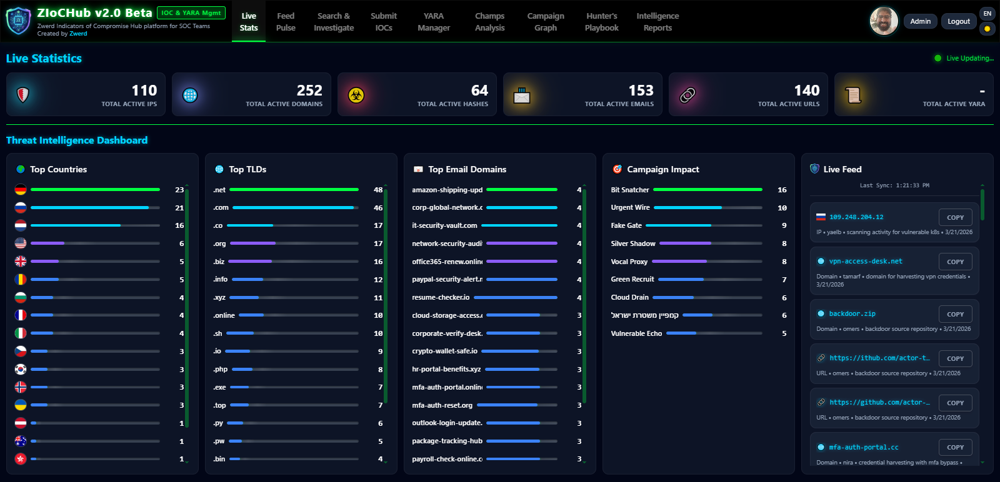
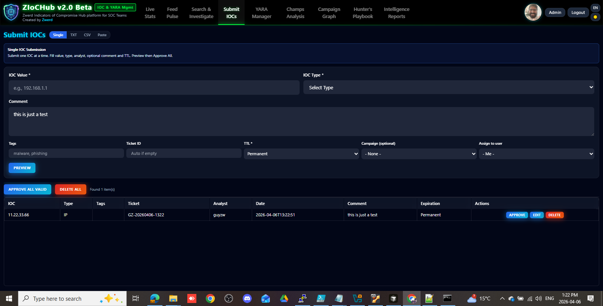
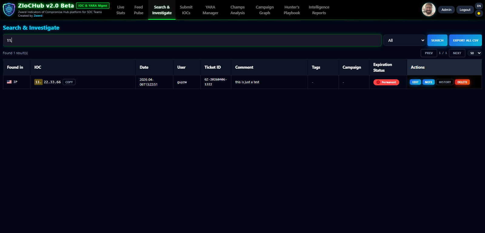
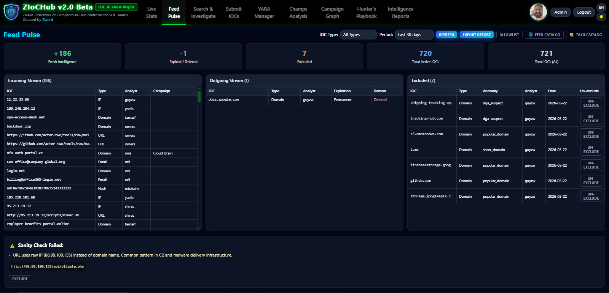
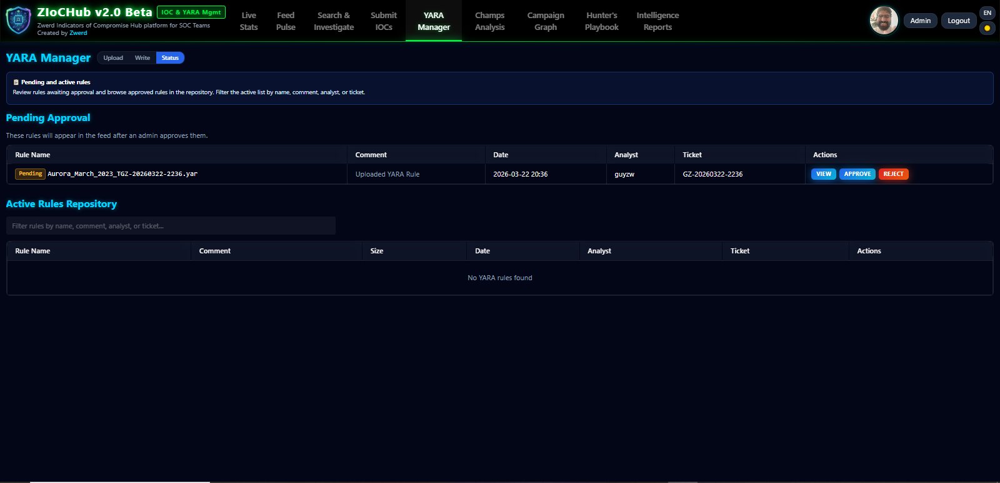
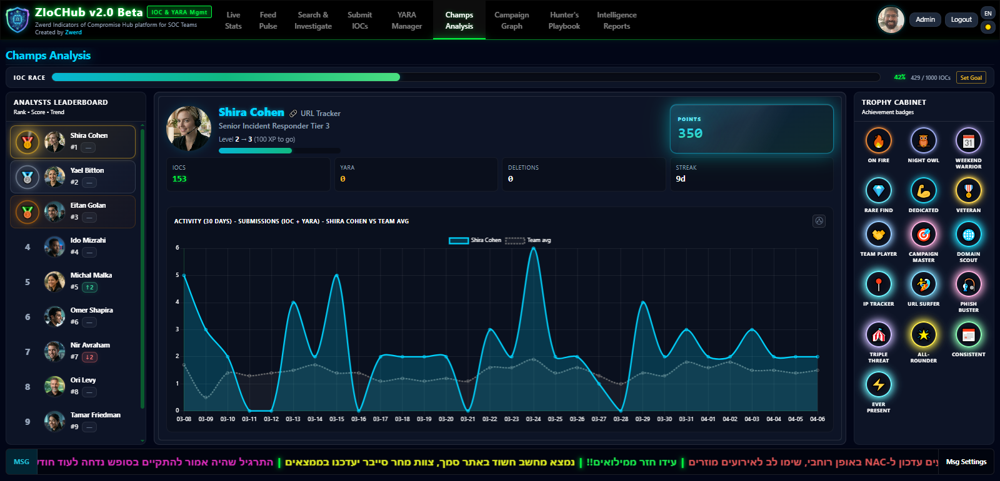
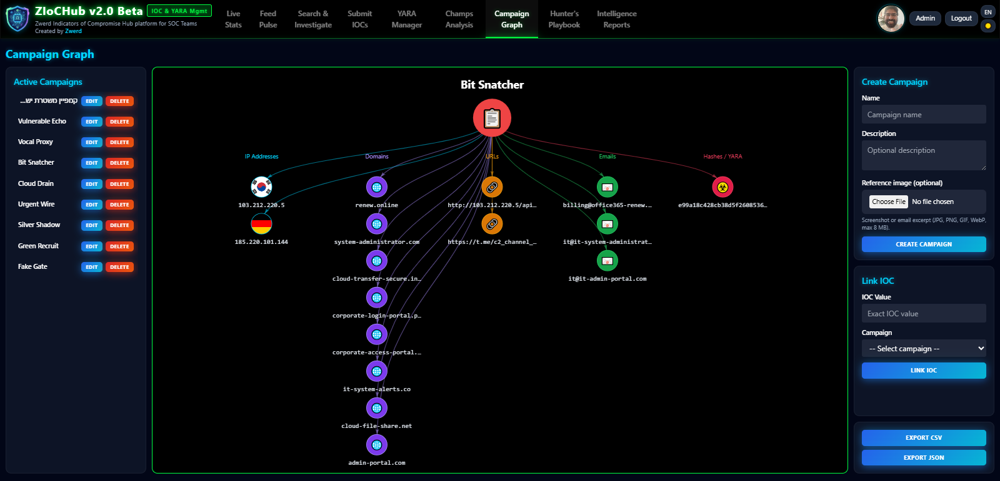
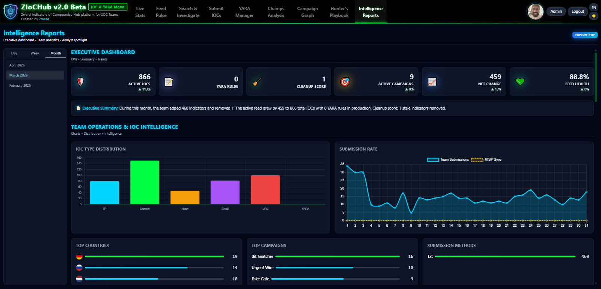
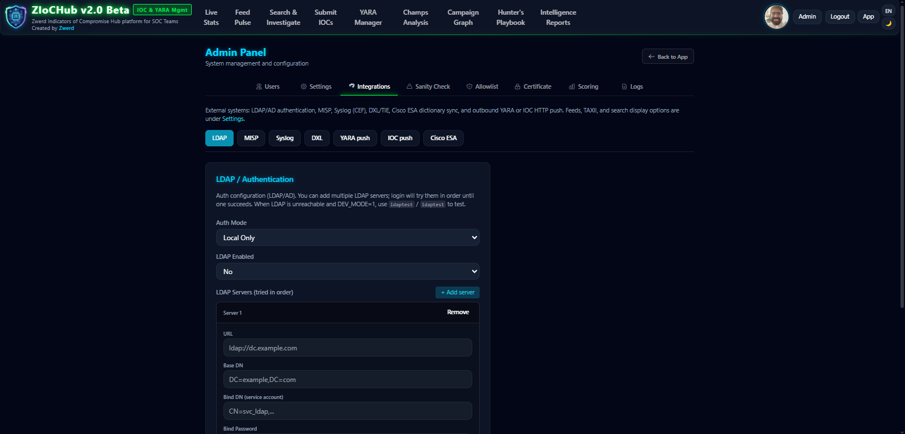
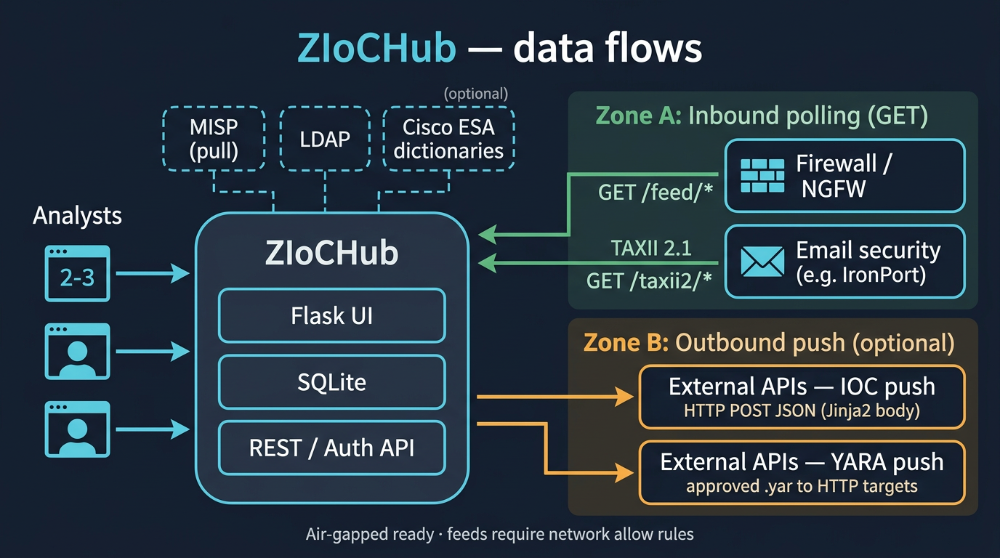
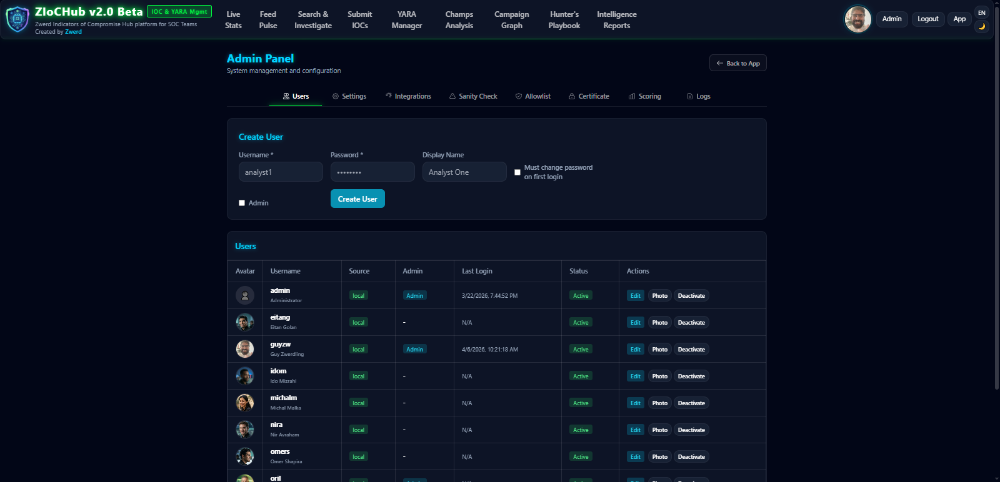
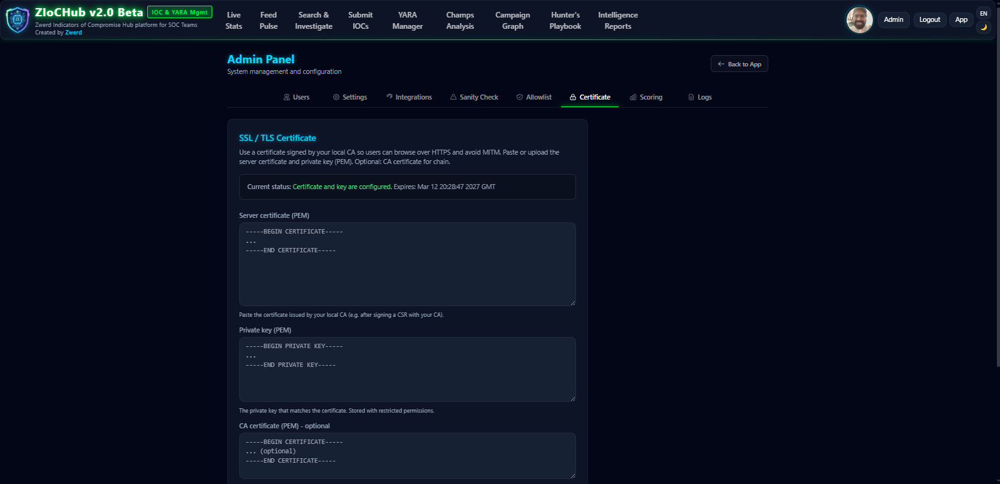

---

<a id="he-value"></a>

## הערך שהמערכת נותנת

### לארגון ול-SOC

| תחום | ערך |
|------|-----|
| מקור אמת | IOC + YARA במקום אחד, תוקף, הערות, קמפיין |
| הזנה לציוד | פידים, PA/CP, TAXII/STIX |
| ביקורת | CEF מקומי + syslog אופציונלי |
| תפעול | offline, גיבויים, cleaner, מיגרציה מ־`data/Main/*.txt` |
| בטיחות | Allowlist |

### לאנליסט

| תחום | ערך |
|------|-----|
| מהירות | זיהוי סוג, refang, ולידציה, אזהרות |
| המוני | CSV/TXT, staging, דופליקציות |
| זיכרון | הערות + היסטוריה + קמפיין |
| YARA | עורך, Prism, קומפילציה בשרת |
| ויזואליזציה | מדינות, TLD, גרף |
| מעורבות | Champs |

### אינטגרציות (כשמופעלות)

MISP, ESA מילונים, LDAP, DXL/TIE, `/health` לניטור.

---

<a id="he-tabs"></a>

## מודולי הממשק (טאבים)

1. **Live Stats** — ספירות, לוחות מובילים, פיד חי.  
2. **Feed Pulse** — חלונות זמן, אנומליות, ייצוא, קטלוגים וחיבורים.  
3. **Search & Investigate** — חיפוש, עריכה, מחיקה, היסטוריה, הערות.  
4. **Submit IOCs** — יחיד ובולק, TTL, קמפיין, תגיות.  
5. **YARA Manager** — Upload / Write / Status.  
6. **Champs Analysis** — דירוגים, יעדים, טיקר.  
7. **Campaign Graph** — יצירה, קישור, ייצוא.  
8. **Hunter's Playbook** — Markdown וקישורים.  
9. **Intelligence Reports** — תקופות ו-PDF.

שפות: `static/i18n/en.json`, `he.json`.

---

<a id="he-install"></a>

## התקנה

### פיתוח (מקומי)

```bash
python3 -m venv venv
source venv/bin/activate   # Windows: venv\Scripts\activate
pip install -r requirements.txt
python app.py
# דפדפן: http://127.0.0.1:5000
```

ברירת מחדל: `admin` / `admin` — **יש לשנות מיד**.

אם **Check syntax** ב-YARA נכשל: ודאו ש־`yara-python` מותקן ב־venv **של אותו Python** שמריץ את האפליקציה. בסביבות offline ראו [`OFFLINE.md`](OFFLINE.md).

### ייצור — עם אינטרנט

```bash
scp -r ZIoCHub/ user@server:/tmp/
cd /tmp/ZIoCHub
sudo ./setup.sh
```

### ייצור — offline

```bash
# מחשב עם אינטרנט:
./package_offline.sh
# העברת ziochub_installer.zip לשרת

unzip ziochub_installer.zip -d ziochub_install
cd ziochub_install
sudo ./setup.sh --offline
```

### שדרוג

```bash
sudo ./setup.sh --upgrade
# או:
sudo ./setup.sh --upgrade --offline
```

### מה `setup.sh` עושה (בקצרה)

בודק Python/SQLite/systemd, יוצר משתמש `ziochub`, מעתיק ל־`/opt/ziochub`, venv + תלויות, אתחול DB, יחידות systemd, הפעלה.

| פרמטר ייצור | ערך נפוץ |
|---------------|----------|
| HTTPS | פורט **8443** |
| הפניה HTTP | **8080** → HTTPS |
| התקנה | `/opt/ziochub` |
| DB | `/opt/ziochub/data/ziochub.db` |
| גיבויים | `/opt/ziochub/backups/` |

---

<a id="he-ports"></a>

## פורטים ורשת

| פורט | פרוטוקול | תיאור |
|------|----------|--------|
| 8443 | HTTPS (או HTTP אם אין תעודה) | Gunicorn — אפליקציה ראשית |
| 8080 | HTTP | הפניה ל-HTTPS |
| 5000 | HTTP | פיתוח בלבד (`python app.py`) |

---

<a id="he-systemd"></a>

## שירותי systemd

| יחידה | תיאור |
|--------|--------|
| `ziochub.service` | Gunicorn |
| `ziochub-redirect.service` | HTTP → HTTPS |
| `ziochub-cleaner.timer` | ניקוי IOC שפג תוקף |
| `ziochub-backup.timer` | גיבוי יומי |
| `ziochub-misp-sync.timer` | סנכרון MISP |

```bash
sudo systemctl status ziochub
sudo systemctl restart ziochub
sudo journalctl -u ziochub -f
```

---

<a id="he-screens"></a>

## מסכי הממשק (פירוט)

- **Live Stats** — דשבורד, מובילים גיאו/TLD/מייל, פיד חי.  
- **Feed Pulse** — נכנס/יוצא/נמחק, allowlist באנומליות, החרגות.  
- **Search** — מסננים מרובים, עריכה, היסטוריה, הערות.  
- **Submit** — יחיד + בולק (CSV/TXT), staging.  
- **YARA** — שלושה מצבים, אישור לממתינים.  
- **Champs** — דירוגים, יעדים (חודש קלנדרי למטרות חודשיות וכו').  
- **Campaigns** — vis-network.  
- **Playbook** — קישורים ותוכן.  
- **Reports** — תקופות ו-PDF.  
- **Admin** — משתמשים, הגדרות ואינטגרציות (LDAP, MISP, Syslog, DXL, ESA, פידים), Allowlist, תעודה, סקורינג Champs.

---

<a id="he-feeds"></a>

## נקודות קצה — פידים

**אין אימות משתמש** על הפידים — להגביל ב-firewall.

### סטנדרטי

| נקודת קצה | תוכן |
|------------|--------|
| `/feed/ip` | IP |
| `/feed/domain` | דומיין |
| `/feed/url` | URL (עם פרוטוקול) |
| `/feed/hash` | כל ה-hash |
| `/feed/md5`, `/sha1`, `/sha256` | לפי אלגוריתם |

### Palo Alto (EDL)

| נקודת קצה | הערה |
|------------|------|
| `/feed/pa/ip`, `/pa/domain` | סטנדרטי |
| `/feed/pa/url` | **ללא** פרוטוקול |
| `/feed/pa/md5` … | hash |

### Checkpoint (CSV)

| נקודת קצה | פורמט |
|------------|--------|
| `/feed/cp/ip`, `domain`, `url` | CSV + observe |
| `/feed/cp/hash` | כל האלגוריתמים הנפוצים |
| `/feed/cp/sha2` | כינוי ל-SHA-256 |

### YARA

| נקודת קצה | תיאור |
|------------|--------|
| `/feed/yara-list` | שמות קבצים **מאושרים** בלבד (קבצים בתיקיית ה-YARA המאושרים) |
| `/feed/yara-content/<filename>` | תוכן גולמי של קובץ מאושר |

**ממתין לאישור מול מערכות חיצוניות:** כללים במצב pending **אינם** מופיעים בפידים האלה. אחרי **עריכת תוכן** לכלל שכבר היה מאושר, הכלל חוזר ל-pending — השם נעלם מהרשימה ו-`/feed/yara-content/...` מחזיר **404** עד אישור אדמין מחדש. זה מכוון: צרכנים מקבלים רק כללים שעברו סינון.

**תפעול:** צוותים שמסנכרנים מהפיד צריכים לצפות להיעדרות **זמנית** של קובץ במהלך חלון pending; לא בהכרח תקלת סנכרון.

פירוט: [`docs/YARA_FEEDS_AND_PENDING.md`](docs/YARA_FEEDS_AND_PENDING.md) (באנגלית).

**הבחנה:** פידי **טקסט ל-IOC** מחזירים ערכים פעילים (לא פגי תוקף). פידי **YARA** מבוססי קבצים מתיקיית המאושרים בלבד — לא אותה לוגיקה כמו תפוגת IOC. `Content-Type: text/plain`.

---

<a id="he-taxii"></a>

## TAXII 2.1 / STIX 2.1

דורש `Accept: application/taxii+json;version=2.1`. דוגמאות נתיבים:

| נתיב | תיאור |
|------|--------|
| `GET /taxii2/` | Discovery |
| `GET /taxii2/ziochub/` | API Root |
| `GET /taxii2/ziochub/collections/` | רשימת אוספים |
| `GET /taxii2/ziochub/collections/indicators/objects/` | אובייקטים (עימוד) |
| `GET .../manifest/` | מניפסט |

פירוט מלא — [`README.md`](README.md).

---

<a id="he-misp"></a>

## אינטגרציית MISP

הגדרה: **Admin** (MISP Integration).

| הגדרה | תיאור |
|--------|--------|
| Sync Enabled | הפעלה |
| URL, API Key | חיבור |
| Verify SSL | אימות תעודה |
| Lookback, Interval (מינימום ~5 דק') | תזמון |
| Tags / Attribute Types | סינון |
| Published only | רק מאירועים שפורסמו |
| Default TTL | תפוגה |
| Sync username | ברירת מחדל `misp_sync` |
| Exclude from Champs | החרגת משתמש הסנכרון מטבלת המובילים |

סוגי מאפיינים נפוצים: `ip-src`/`ip-dst` → IP, `domain` → Domain, `url` → URL, `md5`/`sha256` → Hash, `email` וכו' → Email.

תהליך: טיימר מפעיל `misp_sync_job.py`, בודק מרווח, שולף ב־PyMISP, מוודא כמו הגשה ידנית, מוסיף ללא כפילות, כותב `ioc_history`, נעילת DB נגד מקביליות.

---

<a id="he-esa"></a>

## אינטגרציית Cisco ESA (מילוני תוכן)

אופציונלי: **Admin → Integrations → Cisco ESA**. לאחר login ל-API (JWT), דחיפת מילים לפי מיפוי מילון ↔ סוג IOC (Email / Domain / IP / URL). מצבי deployment: standalone / cluster / group / machine. בדיקת חיבור עושה `GET .../config/dictionaries` עם אותה מחרוזת שאילתה כמו בפעולות המילון.

פירוט גופי בקשה וטריגרים — [`README.md`](README.md) סעיף Cisco ESA.

---

<a id="he-datamodel"></a>

## מודל הנתונים (SQLite)

קובץ: `data/ziochub.db` (בייצור לרוב `/opt/ziochub/data/ziochub.db`).

| טבלה | תיאור |
|--------|--------|
| `users` | משתמשים, מקור (local/ldap), אדמין, סיסמה, `must_change_password`, `last_login_at` |
| `user_profiles` | שם תצוגה, אווטאר, העדפות (צליל, פופאפים) |
| `user_sessions` | כניסה/יציאה, IP |
| `iocs` | סוג, ערך, אנליסט, טיקט, תגובה, תפוגה, קמפיין, `user_id`, תגיות, שדות Rare Find / גיאו |
| `ioc_history` | אירועי מחזור חיים + payload JSON |
| `ioc_notes` | הערות לפי סוג+ערך |
| `campaigns` | שם, תיאור, כיוון טקסט, תמונת התייחסות |
| `yara_rules` | מטא-דאטה, `quality_points`, `status`, קמפיין |
| `sanity_exclusions` | החרגות Feed Pulse |
| `system_settings` | מפתח→ערך (LDAP, MISP, ESA, Champs, syslog…) |
| `activity_events` | לוג Champs / פעילות |
| `team_goals` | יעדי צוות |
| `champ_rank_snapshots` | דירוג יומי |
| `feed_source_last_seen` / מטמון פידים | טלמטריית חיבורי פיד/TAXII (לפי גרסה) |

---

<a id="he-config"></a>

## הגדרות ומשתני סביבה

### משתני סביבה (נבחרים)

| משתנה | ברירת מחדל | תיאור |
|--------|-------------|--------|
| `FLASK_PORT` | 5000 | פיתוח |
| `FLASK_DEBUG` | false | דיבאג |
| `FLASK_ENV` / `ZIOCHUB_ENV` | — | `production` בייצור |
| `DEV_MODE` | 0 | **לא** לפרודקשן |
| `SECRET_KEY` | קובץ/אקראי | סשן Flask |
| `ZIOCHUB_DATA_DIR` | `<app>/data` | נתונים |
| `ADMIN_DEFAULT_PASSWORD` | admin | ראשוני בלבד |
| `ZIOCHUB_PORT` | 8443 | Gunicorn |
| `ZIOCHUB_WORKERS` | 3 | workers |
| `REDIRECT_HTTP_PORT` / `REDIRECT_HTTPS_PORT` | 8080 / 8443 | הפניה |

### אדמין (ממשק)

מצבי אימות, LDAP, MISP, Syslog/CEF, DXL, ESA, פידים ו-TAXII ציבוריים, סקורינג Champs, טיקר, ועוד — לפי עמודי האדמין בפריסה שלכם.

---

<a id="he-maintenance"></a>

## תחזוקה

### גיבוי

`ziochub-backup.timer`: DB, `data/ssl/*.pem`, `data/YARA/*.yar`, `allowlist.txt` — שמירה לרוב 30 יום.

```bash
sudo -u ziochub /opt/ziochub/backup_ziochub.sh
```

### ניקוי פקיעה

`ziochub-cleaner.timer` — מוחק IOC שפג תוקף, רושם `ioc_history`; אם ESA "הסר בפקיעה" פעיל — קורא ל-API לפני מחיקה.

### איפוס נתונים

```bash
cd /opt/ziochub
sudo systemctl stop ziochub
python reset_data.py              # אינטראקטיבי
python reset_data.py --all --yes  # הכל
python reset_data.py --iocs --yara --history --yes
sudo systemctl start ziochub
```

### משתמשי מעבדה

```bash
python create_lab_users.py
# ייצור: create_lab_users.py --env prod (בייצור, מול users.json)
```

### איפוס סיסמה

```bash
sudo -u ziochub /opt/ziochub/venv/bin/python scripts/reset_admin_password.py --username admin --password '...'
```

---

<a id="he-scripts"></a>

## סקריפטים

| סקריפט | תיאור |
|---------|--------|
| `setup.sh` | התקנה / offline / שדרוג |
| `uninstall.sh` | הסרה |
| `package_offline.sh` | ZIP להתקנה מנותקת |
| `backup_ziochub.sh` | גיבוי ידני |
| `reset_data.py` | איפוס נתונים |
| `create_lab_users.py` | משתמשי דמו |
| `cleaner.py` | פקיעה (טיימר) |
| `misp_sync_job.py` | MISP (טיימר) |
| `http_redirect.py` | הפניה |
| `start.sh` | Gunicorn |
| `scripts/reset_admin_password.py` | איפוס סיסמה |

---

<a id="he-security"></a>

## אבטחה

- אימות Flask-Login לדפים ורוב ה-API.  
- פידים ו-TAXII **ציבוריים** — חובה firewall.  
- סיסמאות: scrypt (Werkzeug).  
- LDAP אופציונלי + fallback מקומי.  
- ORM — שאילתות פרמטריות.  
- משתמש `misp_sync` — לא נכנס לממשק.  
- אודיט: **CEF** (`data/audit_cef.log`) + syslog אופציונלי.  
- `DEV_MODE` כבוי בפרודקשן.  
- עוגיות: HttpOnly; SameSite/Secure לפי צורך.

---

<a id="he-architecture"></a>

## ארכיטקטורת הפרויקט

### Backend (עיקרי)

```
app.py                 Flask, אתחול DB, מיגרציות קלות, health
models.py              מודלים
extensions.py          db
constants.py           VERSION, IOC_FILES
config.py              אופציונלי

routes/
  admin.py             משתמשים, הגדרות, תעודה, MISP, ESA test…
  auth.py              login, פרופיל, LDAP
  champs.py            לוח, יעדים, טיקר
  campaigns.py         קמפיינים וגרף
  feeds.py             פידים, עזרי STIX
  ioc.py               הגשת IOC, ESA ברקע
  reports.py           דוחות
  search.py            חיפוש, revoke, ESA
  stats.py             סטטיסטיקות, Feed Pulse API, חיבורים
  taxii_server.py      TAXII 2.1
  yara.py              YARA
```

### Frontend

SPA ב־`templates/index.html`; מודולים ב־`static/js/` (`app.js`, `api.js`, `live-stats.js`, `search.js`, `submit.js`, `yara.js`, `campaigns.js`, `feed-pulse.js`, `champs.js`, `reports.js`, `playbook.js`, `profile.js`, …).

### תבניות נוספות

`templates/login.html`, `templates/admin/*`, partials.

---

<a id="he-offline"></a>

## פריסה אופליינית

- נכסי UI מקומיים; GeoIP מקובץ מקומי.  
- MISP/LDAP — רק לתשתית פנימית.  
- `package_offline.sh` + `setup.sh --offline`.  
- פרטים על Prism/YARA wheels — [`OFFLINE.md`](OFFLINE.md).

---

<a id="he-troubleshooting"></a>

## פתרון בעיות

```bash
journalctl -u ziochub -n 50 --no-pager
```

**DB נעול (SQLite):** מופע יחיד; restart; האפליקציה מבצעת commit עם retry על lock.

**MISP:**

```bash
systemctl status ziochub-misp-sync.timer
journalctl -u ziochub-misp-sync -n 20 --no-pager
```

**הפניה HTTP:**

```bash
systemctl status ziochub-redirect
sudo systemctl restart ziochub ziochub-redirect
```

**התקנה מחדש (עם גיבוי):**

```bash
sudo ./uninstall.sh --backup
sudo ./setup.sh --offline
```

---

<a id="he-version"></a>

## גרסה ורישיונות

- גרסת ממשק: `constants.py` → `VERSION`.  
- **פירוט קוד פתוח בעברית** — סעיף [פרויקטי קוד פתוח](#readme-he-open-source).  
- **רשימה באנגלית + גרסאות pip** — [`README.md`](README.md), [`requirements.txt`](requirements.txt), [`requirements-dev.txt`](requirements-dev.txt).

---

*מסמך README בעברית — מאוחד מ־README_HE + README_HEB. תמונות: `docs/README_HE/images/`.*
